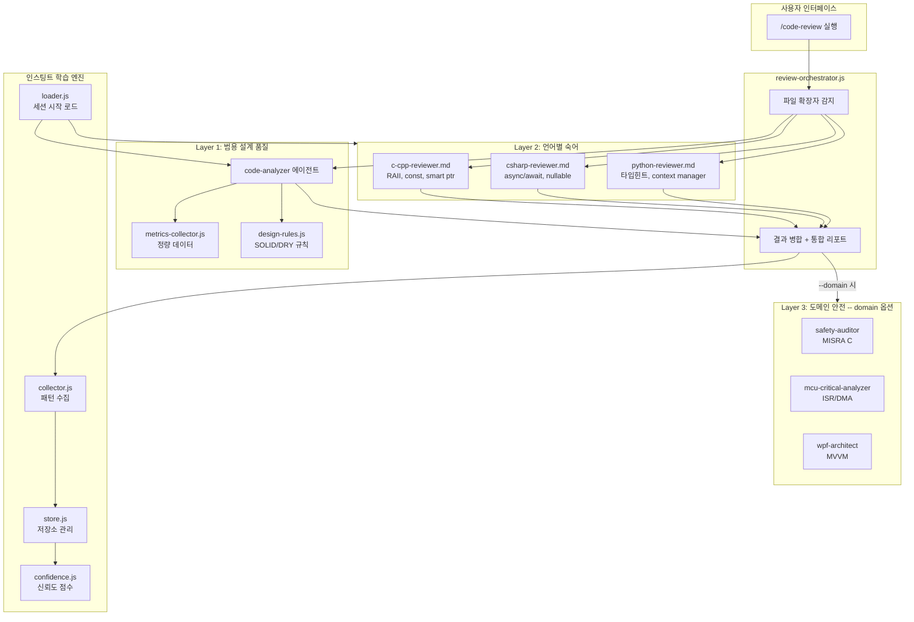
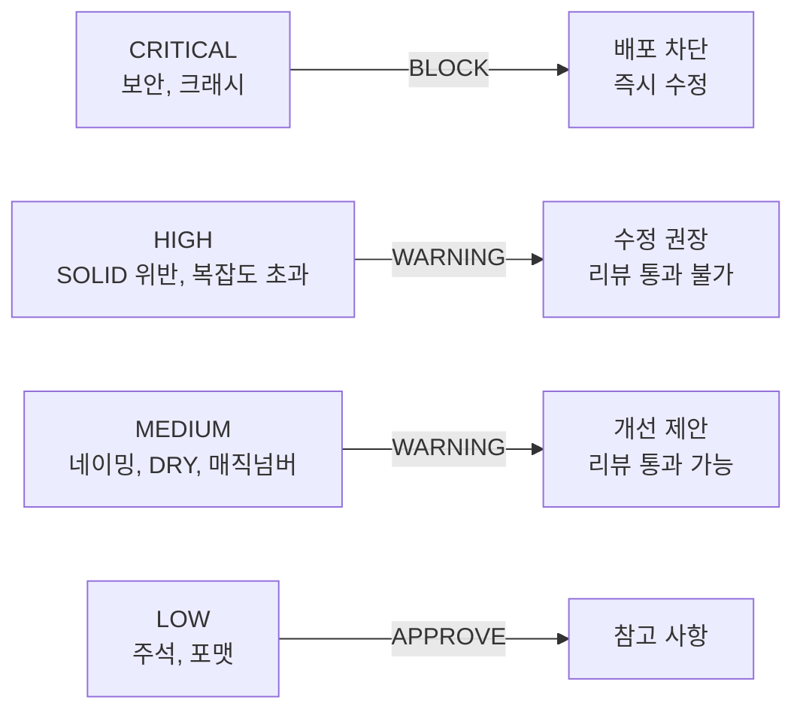
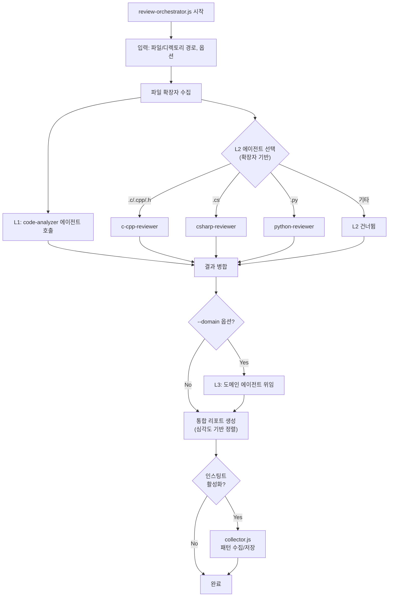

# ecc-insights-integration Design Document

> **Summary**: ECC 인사이트 기반 3-Layer 코드 리뷰 시스템 + 인스팅트 학습 엔진 상세 설계
>
> **Project**: rkit
> **Version**: 0.9.11+
> **Author**: 노수장
> **Date**: 2026-04-09
> **Status**: Draft
> **Planning Doc**: `docs/01-plan/features/ecc-insights-integration.plan.md` (v0.4)
> **PRD**: `docs/00-pm/ecc-insights-integration.prd.md`

---

## 1. Overview

### 1.1 설계 목표

1. **Step 0**: `context-hierarchy.js` 및 `permission-manager.js`의 `core is not defined` 버그를 수정하여 PreToolUse Write 훅 호출 체인을 복구한다
2. **Step 1**: `refs/code-quality/` 문서에 보안 체크리스트, 심각도 분류, AI 감사 규칙, 언어별 보안/동시성 규칙을 추가한다
3. **Step 2**: `code-analyzer` 에이전트를 L1 전용으로 리팩터링하고 SOLID 기반 SQ 규칙을 재편한다
4. **Phase 2**: L2 언어별 숙어 리뷰어 에이전트 3개를 신규 생성한다
5. **Phase 3**: 인스팅트 학습 엔진을 구현하고, 크로스 프로젝트/팀 공유 확장점을 데이터 구조에 미리 포함한다
6. **Phase 4**: 크로스 프로젝트 패턴 승격 및 팀 인스팅트 공유를 구현한다

### 1.2 설계 원칙

| 원칙 | 설명 |
|------|------|
| **계층 분리** | L1(범용 설계) / L2(언어 숙어) / L3(도메인 안전)를 명확히 분리. 각 계층이 독립적으로 동작 |
| **기존 동작 보존** | refs 개선 시 기존 섹션 수정 없이 새 섹션만 추가. COMPACT_RULES 업데이트는 원자적 작업 |
| **lazy require 패턴** | `lib/core/paths.js`의 `getPlatform()` 패턴을 표준으로 사용. 순환 의존성 방지 |
| **확장 가능 데이터 구조** | 인스팅트 JSON 스키마에 `scope`, `origin` 필드를 미리 포함하여 크로스 프로젝트/팀 공유 확장 대비 |
| **Graceful Degradation** | 인스팅트 미활성화 시 기존 동작에 영향 없음. L2 미지원 언어는 L1만 실행 |

---

## 2. Architecture

### 2.1 3-Layer 아키텍처 다이어그램



### 2.2 데이터 흐름

```
1. /code-review [대상 파일/디렉토리]
   │
2. review-orchestrator.js
   ├── 파일 확장자 감지 → 대상 언어 판별
   ├── L1: code-analyzer 호출
   │   ├── metrics-collector.js → 정량 데이터 (복잡도, 함수 크기, 중첩 깊이)
   │   └── design-rules.js → SOLID, DRY, 안티패턴 규칙 제공
   │
   ├── L2: 언어별 리뷰어 선택 (확장자 기반)
   │   ├── .c/.cpp/.h/.hpp → c-cpp-reviewer
   │   ├── .cs → csharp-reviewer
   │   └── .py → python-reviewer
   │
   ├── 결과 병합 → 심각도 기반 정렬
   │   ├── CRITICAL → BLOCK (즉시 수정 필수)
   │   ├── HIGH → WARNING (수정 권장)
   │   ├── MEDIUM → WARNING (개선 제안)
   │   └── LOW → APPROVE (참고)
   │
   ├── [opt-in] --domain → L3 도메인 에이전트 위임
   │
   └── 인스팅트 수집 → .rkit/instinct/{project-hash}/patterns.json
```

### 2.3 의존성 맵

```
scripts/pre-write.js
  └── lib/permission-manager.js
        ├── lib/context-hierarchy.js
        │     ├── lib/core/platform.js (PLUGIN_ROOT, PROJECT_DIR)  ← Step 0 수정
        │     └── lib/core/debug.js (debugLog)                     ← Step 0 수정
        └── lib/core/platform.js (via getPlatform pattern)          ← Step 0 수정

lib/code-quality/review-orchestrator.js (NEW)
  ├── lib/code-quality/design-rules.js (NEW)
  ├── lib/code-quality/metrics-collector.js (EXISTING)
  └── agents/{c-cpp,csharp,python}-reviewer.md (NEW)

lib/instinct/collector.js (NEW)
  ├── lib/instinct/store.js (NEW)
  ├── lib/instinct/confidence.js (NEW)
  └── lib/instinct/loader.js (NEW)
```

---

## 3. Step 0: Bug Fix Design

### 3.1 문제 분석

**원인**: 커밋 `c389514`에서 `lib/common.js` bridge를 제거했을 때 `context-hierarchy.js`와 `permission-manager.js`의 lazy require를 복구하지 않음.

**현재 상태** (`lib/context-hierarchy.js` line 14-21):

```javascript
// Import from common.js (lazy to avoid circular dependency)

function getCommon() {
  if (!_common) {
    // ← body가 비어있음! _common 변수도 미선언
  }
  return _common;
}
```

**문제점**:
1. `_common` 변수가 어디에도 선언되지 않음 (`let _common = null;` 누락)
2. `getCommon()` 함수 body가 비어있어 항상 `undefined` 반환
3. 파일 전체에서 `core.PLUGIN_ROOT` (line 60), `core.PROJECT_DIR` (line 96), `core.debugLog` (line 71, 89, 107, 185, 224, 243) 사용하지만 `core`가 어디에도 정의되지 않음
4. 동일한 버그가 `lib/permission-manager.js` (line 21-26)에도 존재 (line 82에서 `core.debugLog` 사용)

**영향 범위**: `scripts/pre-write.js` → `lib/permission-manager.js` → `lib/context-hierarchy.js` 호출 체인 전체가 `ReferenceError: core is not defined`로 실패.

### 3.2 수정 설계

**참조 패턴** (`lib/core/paths.js` line 9-14):

```javascript
// Lazy require to avoid circular dependency
let _platform = null;
function getPlatform() {
  if (!_platform) { _platform = require('./platform'); }
  return _platform;
}
```

#### 3.2.1 `lib/context-hierarchy.js` 수정

**변경 전** (line 14-21):

```javascript
// Import from common.js (lazy to avoid circular dependency)

function getCommon() {
  if (!_common) {
    
  }
  return _common;
}
```

**변경 후**:

```javascript
// Lazy require to avoid circular dependency (restored after c389514)
let _platform = null;
function getPlatform() {
  if (!_platform) { _platform = require('./core/platform'); }
  return _platform;
}

let _debug = null;
function getDebug() {
  if (!_debug) { _debug = require('./core/debug'); }
  return _debug;
}
```

**`core.PLUGIN_ROOT` / `core.PROJECT_DIR` / `core.debugLog` 치환 목록**:

| 원본 | 수정 후 | 해당 라인 |
|------|---------|----------|
| `core.PLUGIN_ROOT` | `getPlatform().PLUGIN_ROOT` | line 60 |
| `core.PROJECT_DIR` | `getPlatform().PROJECT_DIR` | line 96 |
| `core.debugLog(...)` | `getDebug().debugLog(...)` | line 71, 89, 107, 185, 224, 243 |

#### 3.2.2 `lib/permission-manager.js` 수정

**변경 전** (line 21-26):

```javascript
function getCommon() {
  if (!_common) {
    
  }
  return _common;
}
```

**변경 후**:

```javascript
// Lazy require to avoid circular dependency (restored after c389514)
let _debug = null;
function getDebug() {
  if (!_debug) { _debug = require('./core/debug'); }
  return _debug;
}
```

**치환 목록**:

| 원본 | 수정 후 | 해당 라인 |
|------|---------|----------|
| `core.debugLog(...)` | `getDebug().debugLog(...)` | line 82 |

### 3.3 검증 체크리스트

- [ ] `node -e "require('./lib/context-hierarchy.js')"` 에러 없음
- [ ] `node -e "require('./lib/permission-manager.js')"` 에러 없음
- [ ] `scripts/pre-write.js`가 stdin 입력으로 정상 실행
- [ ] PreToolUse Write 훅 동작 확인 (모든 코드 확장자)
- [ ] 기존 PostToolUse Edit 훅(`code-quality-hook.js`) 동작 미파괴 확인

---

## 4. Step 1: refs 개선 Design

### 4.1 설계 원칙

- **기존 섹션 수정 없음**: 모든 추가는 새 섹션으로. 기존 SQ 규칙 동작 보존
- **pre-guide.js COMPACT_RULES 동기화**: refs 수정과 COMPACT_RULES 업데이트를 하나의 원자적 작업으로 진행
- **ECC 참고, rkit 맥락 적용**: ECC의 언어별 리뷰어 규칙을 참고하되, rkit의 임베디드/WPF 도메인 맥락에 맞게 조정

### 4.2 common.md 추가 섹션

#### 4.2.1 보안 체크리스트 섹션

**추가 위치**: 기존 섹션 최하단 (새 섹션 번호 부여)

```markdown
## N. Security Checklist (ECC-Insight)

### N.1 Hardcoded Secrets
- API 키, 비밀번호, 토큰이 소스에 하드코딩되어 있으면 CRITICAL
- 환경 변수 또는 시크릿 매니저 사용 필수
- 패턴: `password\s*=\s*["']`, `api[_-]?key\s*=\s*["']`, `secret\s*=\s*["']`

### N.2 Injection Prevention
- SQL: 파라미터 바인딩 필수 (문자열 연결 금지)
- Shell: subprocess 호출 시 shell=True 금지 (shlex.split 사용)
- Path Traversal: 사용자 입력 경로에 `../` 방지, path.resolve() 후 prefix 검증

### N.3 Deserialization Safety
- 신뢰할 수 없는 데이터의 역직렬화 금지
- Python pickle, C# BinaryFormatter, Java ObjectInputStream 사용 주의
```

#### 4.2.2 심각도 분류 체계 섹션

```markdown
## M. Severity Classification (ECC-Insight)

| 심각도 | 기준 | 리뷰 액션 |
|--------|------|----------|
| **CRITICAL** | 보안 취약점, 데이터 손실 위험, 크래시 유발 | **BLOCK** — 즉시 수정 필수, 배포 차단 |
| **HIGH** | SOLID 위반, 복잡도 초과(>20), 에러 미처리 | **WARNING** — 수정 권장, 리뷰 통과 불가 |
| **MEDIUM** | 네이밍 불일치, DRY 위반, 매직 넘버 | **WARNING** — 개선 제안, 리뷰 통과 가능 |
| **LOW** | 주석 부족, 포맷팅 불일치 | **APPROVE** — 참고 사항 |
```

#### 4.2.3 AI 생성 코드 감사 규칙 섹션

```markdown
## O. AI-Generated Code Audit Rules (ECC-Insight)

### O.1 필수 검증 항목
- 에러 핸들링: catch 블록이 에러를 삼키지(swallow) 않는지 확인
- 리소스 정리: 파일 핸들, DB 커넥션, 네트워크 소켓의 정리 경로 확인
- 경계 조건: 빈 입력, null, 최대값에서의 동작 확인

### O.2 AI 특유 안티패턴
- 과도한 try-catch: 넓은 범위의 예외 포괄 금지
- 불필요한 추상화: 사용처가 1곳뿐인 인터페이스/팩토리 금지
- 할루시네이션 API: 존재하지 않는 라이브러리/메서드 호출 검증
```

### 4.3 cpp.md 추가 섹션

```markdown
## Security (ECC-Insight)

- 정수 오버플로: 산술 연산 전 범위 검증. `<climits>` / `<cstdint>` 사용
- 버퍼 오버플로: `strncpy`/`snprintf` 사용 필수, `strcpy`/`sprintf` 금지
- 초기화 안된 변수: 선언 시 초기화 필수. `-Wuninitialized` 경고 0건
- 커맨드 인젝션: `system()`, `popen()` 사용 시 입력 검증 필수

## Concurrency Safety (ECC-Insight)

- 데이터 레이스: 공유 변수는 `std::mutex` + `std::scoped_lock` 보호
- 데드락 방지: 락 순서 일관성 유지, `std::scoped_lock`으로 다중 락
- 조건 변수: spurious wakeup 대비 `while` 루프로 조건 확인
- atomic: `std::atomic` 사용 시 메모리 순서 명시 (`memory_order_seq_cst` 기본)

## Sanitizer Guide (ECC-Insight)

- **ASan** (AddressSanitizer): 버퍼 오버플로, use-after-free 탐지. `-fsanitize=address`
- **UBSan** (UndefinedBehaviorSanitizer): 정수 오버플로, 정렬 위반. `-fsanitize=undefined`
- **TSan** (ThreadSanitizer): 데이터 레이스 탐지. `-fsanitize=thread`
- CI에서 ASan + UBSan을 기본 활성화 권장
```

### 4.4 csharp.md 추가 섹션

```markdown
## Nullable Reference Types (ECC-Insight)

- 모든 프로젝트에 `#nullable enable` 필수
- `null!` (null-forgiving) 사용 시 주석으로 이유 설명 필수
- `?.` (null-conditional) + `??` (null-coalescing) 조합으로 방어적 코딩
- DTO/모델 클래스의 `required` 키워드 활용 (C# 11+)

## Security (ECC-Insight)

- **BinaryFormatter 금지**: `System.Runtime.Serialization.Formatters.Binary` 사용 금지 (CVE 다수)
- **Path Traversal**: `Path.Combine()` 후 `Path.GetFullPath()`로 정규화, 기준 디렉토리 접두어 검증
- **Unsafe Deserialization**: `JsonSerializer` (System.Text.Json) 또는 `JsonConvert` (Newtonsoft) 사용
- **SQL Injection**: Dapper의 파라미터화 쿼리 또는 EF Core LINQ 사용 필수

## sealed Class + IOptions Pattern (ECC-Insight)

- 상속이 필요 없는 클래스는 `sealed` 선언 (JIT 최적화 + 설계 의도 명시)
- 설정 클래스: `IOptions<T>` 패턴 사용, 생성자 주입
- Record 타입: 불변 DTO에 `record class` / `record struct` 활용
```

### 4.5 python.md 추가 섹션

```markdown
## Security (ECC-Insight)

- **SQL Injection**: f-string으로 쿼리 구성 금지. 파라미터화 쿼리 필수 (`cursor.execute("SELECT * FROM t WHERE id=%s", (id,))`)
- **Shell Injection**: `subprocess.run(shell=True)` 금지. 리스트 형태로 인자 전달
- **pickle**: 신뢰할 수 없는 소스의 `pickle.load()` 금지. JSON/MessagePack 사용
- **파일 경로**: `os.path.join()` + `os.path.realpath()` 후 기준 디렉토리 접두어 검증

## Anti-patterns (ECC-Insight)

- **가변 기본 인자 금지**: `def f(x=[])` → `def f(x=None): x = x or []`
- **logging > print**: 프로덕션 코드에서 `print()` 대신 `logging` 모듈 사용
- **builtin 섀도잉 금지**: `list`, `dict`, `id`, `type`, `input` 등을 변수명으로 사용 금지
- **bare except 금지**: `except:` → `except Exception:` (최소한 `BaseException` 구분)
```

### 4.6 pre-guide.js COMPACT_RULES 업데이트

**현재** (`lib/code-quality/pre-guide.js` line 315-321):

```javascript
const COMPACT_RULES = {
  cpp:        'C/C++: RAII (unique_ptr), no raw new/delete. ranges/algorithms over raw loops. enum class, constexpr. MISRA if safety-critical.',
  csharp:     'C#: Primary constructors + DI. [ObservableProperty]/[RelayCommand] for WPF. ErrorOr<T> for errors. switch expression over if chains.',
  typescript: 'TS: satisfies for type narrowing. Discriminated unions for variants. Result<T,E> for errors. Record<K,V> as lookup table.',
  python:     'Python: Protocol over ABC. match statement for dispatch. dataclass(frozen=True) for value objects. TaskGroup over gather.',
  c:          'C: MISRA C:2012 Required rules. volatile for HW registers. static for file-scope. sizeof(*ptr) idiom. No dynamic alloc in embedded.',
};
```

**변경 후**:

```javascript
const COMPACT_RULES = {
  cpp:        'C/C++: RAII (unique_ptr), no raw new/delete. ranges/algorithms over raw loops. enum class, constexpr. MISRA if safety-critical. SECURITY: no strcpy/sprintf, check integer overflow. CONCURRENCY: scoped_lock for shared data.',
  csharp:     'C#: Primary constructors + DI. [ObservableProperty]/[RelayCommand] for WPF. ErrorOr<T> for errors. switch expression over if chains. #nullable enable mandatory. sealed for non-inherited classes. No BinaryFormatter.',
  typescript: 'TS: satisfies for type narrowing. Discriminated unions for variants. Result<T,E> for errors. Record<K,V> as lookup table.',
  python:     'Python: Protocol over ABC. match statement for dispatch. dataclass(frozen=True) for value objects. TaskGroup over gather. SECURITY: no f-string SQL, no shell=True, no pickle untrusted. logging over print.',
  c:          'C: MISRA C:2012 Required rules. volatile for HW registers. static for file-scope. sizeof(*ptr) idiom. No dynamic alloc in embedded. SECURITY: strncpy/snprintf only, validate array bounds.',
};
```

**변경 원칙**: 기존 규칙 뒤에 `SECURITY:`, `CONCURRENCY:` 접두사로 핵심 보안/동시성 규칙 1줄 추가. 토큰 예산(300토큰 이내) 유지.

---

## 5. Step 2: code-analyzer L1 Design

### 5.1 SQ 규칙 재편

기존 SQ-001~008을 SOLID 원칙 기반으로 재분류하고 심각도 체계를 적용한다.

| 규칙 ID | 카테고리 | 내용 | 임계값 (warn/error) | 심각도 |
|---------|---------|------|---------------------|--------|
| SQ-001 | Size | 함수 길이 | 40줄 / 80줄 | MEDIUM / HIGH |
| SQ-002 | Size | 파라미터 수 | 3개 / 5개 | MEDIUM / HIGH |
| SQ-003 | Complexity | 중첩 깊이 | 3단계 / 5단계 | MEDIUM / HIGH |
| SQ-004 | Size | 파일 길이 | 300줄 / 500줄 | LOW / MEDIUM |
| SQ-005 | Complexity | 중첩 루프 | depth 2 / 3 | MEDIUM / HIGH |
| SQ-006 | Complexity | if/else-if 분기 체인 | 5개 / 8개 | MEDIUM / HIGH |
| SQ-006b | Complexity | switch case | 8개 / 12개 | MEDIUM / HIGH |
| SQ-007 | SRP | God Class (7+ public methods AND 300+ lines) | - | HIGH |
| SQ-008 | DIP | 아키텍처 위반 (cross-layer import) | - | HIGH |
| **SQ-009** | **DRY** | **코드 중복** (동일 블록 2+ 위치) | - | **MEDIUM** |
| **SQ-010** | **OCP** | **안티패턴: Feature Envy** (4+ 타 객체 필드 접근) | - | **MEDIUM** |
| **SQ-011** | **SRP** | **안티패턴: Primitive Obsession** (3+ primitive params) | - | **MEDIUM** |
| **SQ-012** | **Security** | **보안 위반** (하드코딩 시크릿, 인젝션 패턴) | - | **CRITICAL** |

### 5.2 심각도 → 리뷰 액션 매핑



### 5.3 design-rules.js 모듈 설계

**파일**: `lib/code-quality/design-rules.js` (NEW)

```javascript
/**
 * L1 Design Quality Rules Module
 * @module lib/code-quality/design-rules
 *
 * Exports rule definitions for code-analyzer L1 agent.
 * Separates rule data from analysis logic.
 */

module.exports = {
  // SQ 규칙 정의 (ID, 카테고리, 설명, 임계값, 심각도)
  SQ_RULES: { /* ... 위 표의 데이터 구조화 */ },

  // 심각도 → 리뷰 액션 매핑
  SEVERITY_MAP: {
    CRITICAL: 'BLOCK',
    HIGH: 'WARNING',
    MEDIUM: 'WARNING',
    LOW: 'APPROVE',
  },

  // 순환 복잡도 임계값 (통일)
  COMPLEXITY_THRESHOLDS: { warn: 10, error: 20 },

  // 안티패턴 패턴 정의
  ANTI_PATTERNS: {
    featureEnvy: { threshold: 4, severity: 'MEDIUM' },
    primitiveObsession: { threshold: 3, severity: 'MEDIUM' },
    godClass: { publicMethods: 7, lines: 300, severity: 'HIGH' },
    magicNumber: { severity: 'MEDIUM' },
  },
};
```

**사용처**: `agents/code-analyzer.md`가 imports 또는 런타임에서 이 모듈의 규칙 정의를 참조.

### 5.4 code-analyzer.md 리팩터링 요점

1. **기존 SQ-001~008 유지** + SQ-009~012 추가
2. **심각도 분류 체계** 적용 (`common.md` Section M 기반)
3. **웹앱 전용 섹션 비활성화**: Phase 4 API 일관성, Phase 6 UI-API 통합 섹션을 조건부로 (웹 도메인일 때만 활성화)
4. **보안 검사 강화**: 기존 OWASP Top 10 + 임베디드 보안 (커맨드 인젝션, 버퍼 오버플로)
5. **출력 포맷**: 심각도 기반 정렬, BLOCK/WARNING/APPROVE 레이블

---

## 6. L2 Language Reviewers Design

### 6.1 에이전트 공통 구조

L2 에이전트 3개(`c-cpp-reviewer.md`, `csharp-reviewer.md`, `python-reviewer.md`)는 동일한 메타데이터 구조를 공유한다.

```yaml
---
name: {lang}-reviewer
description: |
  L2 language idiom reviewer for {language}.
  Checks language-specific best practices, idioms, and security patterns.
model: opus
effort: high
maxTurns: 15
linked-from-skills:
  - code-review: default
imports:
  - ${PLUGIN_ROOT}/refs/code-quality/{ref-file}.md    # 개선된 refs 참조
  - ${PLUGIN_ROOT}/refs/code-quality/common.md         # 심각도 분류 + 보안
tools:
  - Read
  - Glob
  - Grep
---
```

### 6.2 언어 감지 로직

**review-orchestrator.js** 내에서 파일 확장자 기반으로 L2 에이전트를 선택한다. 도메인 감지(`domain/detector.js`)와는 **분리**.

```javascript
const L2_AGENT_MAP = {
  '.c':   'c-cpp-reviewer',
  '.cpp': 'c-cpp-reviewer',
  '.cc':  'c-cpp-reviewer',
  '.cxx': 'c-cpp-reviewer',
  '.h':   'c-cpp-reviewer',
  '.hpp': 'c-cpp-reviewer',
  '.cs':  'csharp-reviewer',
  '.py':  'python-reviewer',
};

function selectL2Agent(filePath) {
  const ext = path.extname(filePath).toLowerCase();
  return L2_AGENT_MAP[ext] || null;  // null이면 L2 건너뜀
}
```

### 6.3 각 에이전트 리뷰 항목

#### c-cpp-reviewer.md

| 카테고리 | 검사 항목 | 참조 |
|---------|----------|------|
| RAII | `unique_ptr`/`shared_ptr` 사용, raw `new`/`delete` 금지 | cpp.md 기존 |
| const correctness | `const` 참조 파라미터, `constexpr` 활용 | cpp.md 기존 |
| Smart Pointer | `make_unique`/`make_shared` 사용 | cpp.md 기존 |
| **보안** | 버퍼 오버플로, 정수 오버플로, 초기화 안된 변수 | cpp.md 보안 섹션 (NEW) |
| **동시성** | 데이터 레이스, 데드락, `scoped_lock` | cpp.md 동시성 섹션 (NEW) |
| **Sanitizer** | ASan/UBSan/TSan 적용 여부 | cpp.md sanitizer 섹션 (NEW) |

#### csharp-reviewer.md

| 카테고리 | 검사 항목 | 참조 |
|---------|----------|------|
| async/await | `ConfigureAwait`, fire-and-forget, deadlock 패턴 | csharp.md 기존 |
| **Nullable** | `#nullable enable`, `null!` 사용 이유, `?.`/`??` | csharp.md nullable 섹션 (NEW) |
| IDisposable | `using` 선언, `IAsyncDisposable` | csharp.md 기존 |
| **보안** | BinaryFormatter 금지, Path Traversal | csharp.md 보안 섹션 (NEW) |
| **sealed/IOptions** | `sealed` 클래스, `IOptions<T>` DI 패턴 | csharp.md sealed 섹션 (NEW) |

#### python-reviewer.md

| 카테고리 | 검사 항목 | 참조 |
|---------|----------|------|
| Type Hints | 함수 시그니처 타입 어노테이션 | python.md 기존 |
| Context Manager | `with` 문 활용, `contextlib` | python.md 기존 |
| dataclass | `@dataclass(frozen=True)` 불변 객체 | python.md 기존 |
| **보안** | SQL/셸 인젝션, pickle, 파일 경로 | python.md 보안 섹션 (NEW) |
| **안티패턴** | 가변 기본 인자, print vs logging, builtin 섀도잉 | python.md 안티패턴 섹션 (NEW) |

### 6.4 L3 도메인 위임

`--domain` 옵션 사용 시 `review-orchestrator.js`가 기존 에이전트에 위임한다.

```javascript
const L3_DOMAIN_MAP = {
  mcu: ['safety-auditor', 'mcu-critical-analyzer'],
  mpu: ['linux-bsp-expert'],
  wpf: ['wpf-architect'],
};
```

---

## 7. Instinct Engine Design

### 7.1 디렉토리 구조

```
.rkit/instinct/
├── {project-hash}/           # 프로젝트별 저장소
│   ├── patterns.json         # 학습된 패턴
│   └── confidence.json       # 신뢰도 점수
└── global/                   # Phase 4: 크로스 프로젝트 승격
    ├── patterns.json
    └── confidence.json
```

### 7.2 프로젝트 식별

```javascript
/**
 * 프로젝트 해시 생성
 * 1차: git remote URL 기반 (ECC 방식과 동일)
 * 2차: 디렉토리 경로 해시 (remote 없을 때 fallback)
 */
function getProjectHash() {
  try {
    const remote = execSync('git remote get-url origin', { encoding: 'utf8' }).trim();
    return crypto.createHash('sha256').update(remote).digest('hex').slice(0, 12);
  } catch {
    const projectDir = getPlatform().PROJECT_DIR;
    return crypto.createHash('sha256').update(projectDir).digest('hex').slice(0, 12);
  }
}
```

### 7.3 patterns.json 스키마

```json
{
  "$schema": "draft-07",
  "type": "object",
  "properties": {
    "version": { "type": "string", "const": "1.0.0" },
    "projectId": { "type": "string", "description": "SHA-256 해시 (12자)" },
    "projectMeta": {
      "type": "object",
      "properties": {
        "remoteUrl": { "type": "string" },
        "domain": { "type": "string", "enum": ["mcu", "mpu", "wpf", "unknown"] },
        "languages": {
          "type": "array",
          "items": { "type": "string", "enum": ["c", "cpp", "csharp", "python", "typescript", "javascript"] }
        }
      }
    },
    "patterns": {
      "type": "array",
      "items": {
        "type": "object",
        "required": ["id", "category", "pattern", "correction", "confidence", "scope", "origin"],
        "properties": {
          "id": { "type": "string", "description": "고유 패턴 ID (UUID v4)" },
          "category": {
            "type": "string",
            "enum": ["naming", "structure", "idiom", "security", "convention", "architecture"]
          },
          "pattern": {
            "type": "object",
            "properties": {
              "description": { "type": "string" },
              "example": { "type": "string", "description": "위반 코드 예시" },
              "language": { "type": "string" }
            }
          },
          "correction": {
            "type": "object",
            "properties": {
              "description": { "type": "string" },
              "example": { "type": "string", "description": "교정된 코드 예시" }
            }
          },
          "confidence": {
            "type": "number", "minimum": 0, "maximum": 1,
            "description": "신뢰도 점수 (0-1)"
          },
          "scope": {
            "type": "string",
            "enum": ["project", "global", "team"],
            "description": "확장점: project=프로젝트 로컬, global=크로스 프로젝트 승격, team=팀 공유"
          },
          "origin": {
            "type": "object",
            "description": "확장점: 패턴 출처 추적",
            "properties": {
              "projectId": { "type": "string" },
              "sessionId": { "type": "string" },
              "timestamp": { "type": "string", "format": "date-time" },
              "source": {
                "type": "string",
                "enum": ["review", "correction", "manual", "promoted"],
                "description": "review=L1/L2 리뷰 결과, correction=사용자 교정, manual=수동 등록, promoted=글로벌 승격"
              }
            }
          },
          "sessions": {
            "type": "array",
            "description": "패턴이 관찰/적용된 세션 목록",
            "items": {
              "type": "object",
              "properties": {
                "sessionId": { "type": "string" },
                "timestamp": { "type": "string", "format": "date-time" },
                "action": { "type": "string", "enum": ["detected", "applied", "rejected"] }
              }
            }
          },
          "tags": {
            "type": "array",
            "items": { "type": "string" },
            "description": "검색/필터용 태그 (예: ['embedded', 'hal', 'stm32'])"
          }
        }
      }
    },
    "metadata": {
      "type": "object",
      "properties": {
        "totalSessions": { "type": "integer" },
        "lastUpdated": { "type": "string", "format": "date-time" },
        "schemaVersion": { "type": "string" }
      }
    }
  }
}
```

### 7.4 confidence.json 스키마

```json
{
  "$schema": "draft-07",
  "type": "object",
  "properties": {
    "version": { "type": "string", "const": "1.0.0" },
    "projectId": { "type": "string" },
    "scores": {
      "type": "object",
      "description": "패턴 ID → 신뢰도 이력",
      "additionalProperties": {
        "type": "object",
        "properties": {
          "current": { "type": "number", "minimum": 0, "maximum": 1 },
          "history": {
            "type": "array",
            "items": {
              "type": "object",
              "properties": {
                "session": { "type": "integer" },
                "score": { "type": "number" },
                "delta": { "type": "number" },
                "reason": { "type": "string", "enum": ["applied", "rejected", "decay", "promoted"] }
              }
            }
          },
          "convergedAt": {
            "type": ["integer", "null"],
            "description": "수렴한 세션 번호 (null이면 미수렴)"
          },
          "promotable": {
            "type": "boolean",
            "description": "확장점: 글로벌 승격 후보 여부"
          }
        }
      }
    },
    "globalCandidates": {
      "type": "array",
      "description": "확장점: 크로스 프로젝트 승격 후보 패턴 ID 목록",
      "items": { "type": "string" }
    }
  }
}
```

### 7.5 수렴 알고리즘

```
초기 신뢰도: 0.3 (첫 관찰)

세션마다:
  - 패턴 적용됨 (applied):  confidence += 0.2 * (1 - confidence)
  - 패턴 거부됨 (rejected): confidence -= 0.3 * confidence
  - 패턴 미관찰 (decay):    confidence -= 0.05 * confidence

수렴 판정:
  - 3 연속 세션에서 delta < 0.05 → converged
  - converged 패턴: 자동 적용 (프롬프트에 주입)
  - confidence < 0.1 → 패턴 비활성화 (삭제하지 않음)

승격 기준 (Phase 4):
  - confidence >= 0.8
  - 3+ 프로젝트에서 동일 패턴 관찰
  - 동일 도메인 (domain 필드 일치)
  → scope: "project" → "global"로 승격
```

**수렴 시각화 예시**:

```
Session  1: confidence = 0.30 (초기)
Session  2: confidence = 0.44 (+applied)
Session  3: confidence = 0.55 (+applied)  → delta=0.11, 미수렴
Session  4: confidence = 0.64 (+applied)  → delta=0.09, 미수렴
Session  5: confidence = 0.71 (+applied)  → delta=0.07, 미수렴
Session  6: confidence = 0.77 (+applied)  → delta=0.06, 미수렴
Session  7: confidence = 0.81 (+applied)  → delta=0.04, 수렴 시작
Session  8: confidence = 0.85 (+applied)  → delta=0.04, 수렴 2회
Session  9: confidence = 0.88 (+applied)  → delta=0.03, 수렴 3회 → converged!
```

### 7.6 모듈 설계

#### collector.js

```javascript
/**
 * 인스팅트 패턴 수집기
 * @module lib/instinct/collector
 *
 * 역할: L1/L2 리뷰 결과 + 사용자 교정에서 패턴을 추출하여 store에 저장
 */
module.exports = {
  /**
   * 리뷰 결과에서 패턴 추출
   * @param {Object} reviewResult - L1/L2 리뷰 결과
   * @param {string} sessionId - 현재 세션 ID
   * @returns {Object[]} 추출된 패턴 배열
   */
  extractPatterns(reviewResult, sessionId) { /* ... */ },

  /**
   * 사용자 교정 이벤트에서 패턴 추출
   * @param {Object} correctionEvent - { before, after, filePath }
   * @param {string} sessionId
   * @returns {Object|null} 추출된 패턴 또는 null
   */
  extractCorrectionPattern(correctionEvent, sessionId) { /* ... */ },
};
```

#### store.js

```javascript
/**
 * 인스팅트 저장소 관리
 * @module lib/instinct/store
 *
 * 역할: patterns.json/confidence.json 읽기/쓰기, 무결성 검증
 * 확장점: global/ 디렉토리 접근 (Phase 4)
 */
module.exports = {
  loadPatterns(projectHash) { /* ... */ },
  savePatterns(projectHash, patterns) { /* ... */ },
  loadConfidence(projectHash) { /* ... */ },
  saveConfidence(projectHash, confidence) { /* ... */ },

  // Phase 4 확장점
  loadGlobalPatterns() { /* ... */ },
  promoteToGlobal(patternId, projectHash) { /* ... */ },
};
```

#### loader.js

```javascript
/**
 * 세션 시작 시 인스팅트 프로파일 로드
 * @module lib/instinct/loader
 *
 * 역할: SessionStart 훅에서 호출되어 수렴된 패턴을 세션 컨텍스트에 주입
 */
module.exports = {
  /**
   * 수렴된 패턴 로드 및 프롬프트 생성
   * @returns {string} 프롬프트에 주입할 인스팅트 규칙 텍스트
   */
  loadConvergedPatterns() { /* ... */ },

  /**
   * 인스팅트 프로파일 요약 (사용자에게 표시)
   * @returns {Object} { totalPatterns, converged, active, lastUpdated }
   */
  getProfileSummary() { /* ... */ },
};
```

#### confidence.js

```javascript
/**
 * 신뢰도 점수 알고리즘
 * @module lib/instinct/confidence
 *
 * 역할: 패턴별 신뢰도 계산, 수렴 판정, 승격 후보 판별
 */
module.exports = {
  INITIAL_CONFIDENCE: 0.3,
  APPLY_FACTOR: 0.2,
  REJECT_FACTOR: 0.3,
  DECAY_FACTOR: 0.05,
  CONVERGENCE_THRESHOLD: 0.05,
  CONVERGENCE_SESSIONS: 3,

  /**
   * 신뢰도 업데이트
   * @param {number} current - 현재 신뢰도
   * @param {'applied'|'rejected'|'decay'} action
   * @returns {{ score: number, delta: number }}
   */
  updateConfidence(current, action) { /* ... */ },

  /**
   * 수렴 판정
   * @param {Object[]} history - 최근 세션 이력
   * @returns {boolean}
   */
  isConverged(history) { /* ... */ },

  /**
   * 글로벌 승격 후보 판별 (Phase 4)
   * @param {number} confidence
   * @param {number} projectCount - 관찰된 프로젝트 수
   * @returns {boolean}
   */
  isPromotable(confidence, projectCount) {
    return confidence >= 0.8 && projectCount >= 3;
  },
};
```

---

## 8. Review Orchestrator Design

### 8.1 오케스트레이션 흐름

**파일**: `lib/code-quality/review-orchestrator.js` (NEW)



### 8.2 통합 리포트 포맷

```markdown
# Code Review Report

## 리뷰 대상
- 경로: {분석 대상 경로}
- 파일 수: {N}
- 언어: {감지된 언어 목록}
- 실행 일시: {timestamp}

## 품질 점수: {score}/100

## BLOCK (즉시 수정 필수)
| 심각도 | 계층 | 파일 | 라인 | 규칙 | 이슈 | 권장 조치 |
|--------|-----|------|------|------|------|----------|
| CRITICAL | L1 | src/api.c | 42 | SQ-012 | 하드코딩된 API 키 | 환경 변수 사용 |

## WARNING (수정 권장)
| 심각도 | 계층 | 파일 | 라인 | 규칙 | 이슈 | 권장 조치 |
|--------|-----|------|------|------|------|----------|
| HIGH | L1 | src/main.c | 120 | SQ-001 | 함수 85줄 초과 | 헬퍼 함수로 분리 |
| HIGH | L2 | src/driver.cpp | 55 | RAII | raw delete 사용 | unique_ptr 적용 |

## APPROVE (참고)
| 심각도 | 계층 | 파일 | 라인 | 규칙 | 이슈 |
|--------|-----|------|------|------|------|
| LOW | L1 | src/utils.c | 10 | Comment | public API 문서 누락 |

## 요약
- BLOCK: {N}건 / WARNING: {N}건 / APPROVE: {N}건
- 리뷰 판정: {BLOCK 있으면 "BLOCKED", WARNING만 있으면 "CONDITIONAL", APPROVE만이면 "APPROVED"}
```

### 8.3 모듈 인터페이스

```javascript
/**
 * Review Orchestrator
 * @module lib/code-quality/review-orchestrator
 *
 * L1 + L2 + L3 코드 리뷰 오케스트레이션
 */
module.exports = {
  /**
   * 통합 코드 리뷰 실행
   * @param {Object} options
   * @param {string} options.target - 파일/디렉토리 경로
   * @param {boolean} [options.domain=false] - L3 도메인 리뷰 활성화
   * @param {string} [options.domainType] - 'mcu' | 'mpu' | 'wpf'
   * @returns {Object} ReviewResult
   */
  runReview(options) { /* ... */ },

  /**
   * 리뷰 결과를 마크다운 리포트로 변환
   * @param {Object} result - ReviewResult
   * @returns {string} 마크다운 문자열
   */
  formatReport(result) { /* ... */ },
};
```

---

## 9. Error Handling

### 9.1 Step 0 관련 에러 처리

| 상황 | 처리 방식 |
|------|----------|
| `require('./core/platform')` 실패 | 빈 객체 반환 (`{ PLUGIN_ROOT: '', PROJECT_DIR: process.cwd() }`) |
| `require('./core/debug')` 실패 | no-op debugLog 사용 (`() => {}`) |
| permission-manager 로드 실패 | `pre-write.js`에서 이미 try-catch로 null fallback 처리 (기존 동작 유지) |

### 9.2 인스팅트 에러 처리

| 상황 | 처리 방식 |
|------|----------|
| `patterns.json` 파싱 실패 | 백업에서 복구 시도, 실패 시 빈 패턴으로 초기화 |
| `confidence.json` 파싱 실패 | 모든 패턴의 신뢰도를 0.3으로 리셋 |
| 디스크 쓰기 실패 | 경고 로그 출력, 세션 내 메모리에서만 유지 |
| git remote 조회 실패 | 경로 해시로 fallback (설계 7.2절 참조) |
| 인스팅트 저장소 크기 초과 (>50KB) | 가장 낮은 신뢰도 패턴부터 정리 (maxPatternsPerProject: 100) |

### 9.3 리뷰 오케스트레이터 에러 처리

| 상황 | 처리 방식 |
|------|----------|
| L1 에이전트 타임아웃 (>30초) | 부분 결과 반환 + 타임아웃 경고 |
| L2 에이전트 지원 안되는 언어 | L2 건너뛰고 L1 결과만 반환 |
| L3 도메인 에이전트 미설치 | L3 결과 없이 L1+L2만 반환 + 안내 메시지 |
| metrics-collector.js 실패 | 정량 데이터 없이 LLM 정성 분석만 실행 |

---

## 10. Test Plan

### 10.1 Step 0 테스트

| ID | 테스트 | 검증 방법 | 합격 기준 |
|----|--------|----------|----------|
| T-S0-01 | context-hierarchy.js 로드 | `node -e "require('./lib/context-hierarchy.js')"` | 에러 없음 |
| T-S0-02 | permission-manager.js 로드 | `node -e "require('./lib/permission-manager.js')"` | 에러 없음 |
| T-S0-03 | PreToolUse Write 훅 실행 | 테스트 파일 Write 시도 → 훅 실행 확인 | exitCode 0, JSON 출력 |
| T-S0-04 | 기존 PostToolUse Edit 훅 | `code-quality-hook.js` 실행 | 기존 동작 유지 |
| T-S0-05 | getContextHierarchy 호출 | 캐시/비캐시 모두 | 에러 없이 결과 반환 |

### 10.2 Step 1 테스트

| ID | 테스트 | 검증 방법 | 합격 기준 |
|----|--------|----------|----------|
| T-S1-01 | refs/code-quality/common.md 구조 | 보안/심각도/AI감사 섹션 존재 확인 | 3개 섹션 모두 존재 |
| T-S1-02 | refs/code-quality/cpp.md 구조 | 보안/동시성/sanitizer 섹션 존재 | 3개 섹션 모두 존재 |
| T-S1-03 | refs/code-quality/csharp.md 구조 | nullable/보안/sealed 섹션 존재 | 3개 섹션 모두 존재 |
| T-S1-04 | refs/code-quality/python.md 구조 | 보안/안티패턴 섹션 존재 | 2개 섹션 모두 존재 |
| T-S1-05 | COMPACT_RULES 토큰 예산 | 각 규칙 문자열 길이 측정 | 300토큰 이내 유지 |
| T-S1-06 | rkit-rules 스킬 동작 | `/rkit-rules` 실행 | 기존 동작 미파괴 |
| T-S1-07 | pdca 스킬 동작 | `/pdca status` 실행 | 기존 동작 미파괴 |

### 10.3 Step 2 테스트

| ID | 테스트 | 검증 방법 | 합격 기준 |
|----|--------|----------|----------|
| T-S2-01 | SQ-001~012 규칙 적용 | code-analyzer로 테스트 파일 분석 | 모든 규칙 탐지 |
| T-S2-02 | 심각도 분류 | CRITICAL/HIGH/MEDIUM/LOW 각 케이스 | 올바른 매핑 |
| T-S2-03 | 통합 리포트 포맷 | 리뷰 결과 마크다운 출력 | 심각도 기반 정렬 |
| T-S2-04 | design-rules.js 모듈 | `require('./lib/code-quality/design-rules')` | 에러 없음, 규칙 데이터 유효 |

### 10.4 Phase 2 테스트

| ID | 테스트 | 검증 방법 | 합격 기준 |
|----|--------|----------|----------|
| T-P2-01 | 언어 감지 | .c/.cs/.py 확장자 → 올바른 L2 에이전트 | 100% 정확도 |
| T-P2-02 | c-cpp-reviewer | 보안/동시성 위반 코드 분석 | 보안 이슈 탐지 |
| T-P2-03 | csharp-reviewer | nullable/async 위반 코드 분석 | 패턴 위반 탐지 |
| T-P2-04 | python-reviewer | 가변 기본 인자/pickle 사용 코드 분석 | 안티패턴 탐지 |
| T-P2-05 | L1+L2 통합 | 동일 파일에 L1+L2 결과 병합 | 중복 없는 통합 리포트 |

### 10.5 Phase 3 테스트

| ID | 테스트 | 검증 방법 | 합격 기준 |
|----|--------|----------|----------|
| T-P3-01 | 패턴 수집 | 리뷰 결과에서 패턴 추출 | patterns.json 업데이트 |
| T-P3-02 | 신뢰도 계산 | applied/rejected/decay 시나리오 | 올바른 점수 변화 |
| T-P3-03 | 3세션 수렴 | 3회 연속 적용 시나리오 | convergedAt 값 설정 |
| T-P3-04 | 세션 로드 | 수렴된 패턴 프롬프트 주입 | 주입 텍스트 생성 |
| T-P3-05 | 저장소 크기 | 100+ 패턴 시나리오 | 50KB 이내 |

---

## 11. Implementation Order

```mermaid
flowchart TD
    S0["Step 0: Bug Fix\ncontext-hierarchy.js\npermission-manager.js"] --> S1
    S1["Step 1: refs 개선\ncommon.md, cpp.md\ncsharp.md, python.md\npre-guide.js COMPACT_RULES"] --> S2
    S2["Step 2: code-analyzer L1\nSQ 규칙 재편\ndesign-rules.js 분리\n심각도 분류 적용"] --> P2
    P2["Phase 2: L2 리뷰어\nc-cpp-reviewer.md\ncsharp-reviewer.md\npython-reviewer.md\nreview-orchestrator.js"] --> P3
    P3["Phase 3: 인스팅트 엔진\ncollector.js, store.js\nloader.js, confidence.js\n.rkit/instinct/ 저장소"] --> P4
    P4["Phase 4: 크로스 프로젝트\n글로벌 승격\n팀 공유 (git submodule)"]

    S0 ---|"v0.9.11"| S1
    S1 ---|"v0.9.11"| S2
    S2 ---|"v0.9.11"| P2_LABEL
    P2 ---|"v0.9.12"| P2_LABEL[""]
    P3 ---|"v0.9.13"| P3_LABEL[""]
    P4 ---|"v0.9.14"| P4_LABEL[""]
```

### 상세 구현 순서

| 순서 | 작업 | 대상 파일 | 버전 | 선행 조건 |
|------|------|----------|------|----------|
| 1 | Bug Fix: lazy require 복구 | `lib/context-hierarchy.js` | v0.9.11 | 없음 |
| 2 | Bug Fix: lazy require 복구 | `lib/permission-manager.js` | v0.9.11 | 없음 |
| 3 | Bug Fix: 훅 체인 검증 | `scripts/pre-write.js` | v0.9.11 | 1, 2 |
| 4 | refs: 보안+심각도+AI감사 | `refs/code-quality/common.md` | v0.9.11 | 없음 |
| 5 | refs: 보안+동시성+sanitizer | `refs/code-quality/cpp.md` | v0.9.11 | 없음 |
| 6 | refs: nullable+보안+sealed | `refs/code-quality/csharp.md` | v0.9.11 | 없음 |
| 7 | refs: 보안+안티패턴 | `refs/code-quality/python.md` | v0.9.11 | 없음 |
| 8 | COMPACT_RULES 업데이트 | `lib/code-quality/pre-guide.js` | v0.9.11 | 4-7 |
| 9 | 회귀 테스트 | rkit-rules, pdca 스킬 | v0.9.11 | 8 |
| 10 | L1 규칙 모듈 생성 | `lib/code-quality/design-rules.js` | v0.9.11 | 4 |
| 11 | code-analyzer 리팩터링 | `agents/code-analyzer.md` | v0.9.11 | 10 |
| 12 | L2 C/C++ 리뷰어 | `agents/c-cpp-reviewer.md` | v0.9.12 | 5, 11 |
| 13 | L2 C# 리뷰어 | `agents/csharp-reviewer.md` | v0.9.12 | 6, 11 |
| 14 | L2 Python 리뷰어 | `agents/python-reviewer.md` | v0.9.12 | 7, 11 |
| 15 | 오케스트레이터 | `lib/code-quality/review-orchestrator.js` | v0.9.12 | 11-14 |
| 16 | 인스팅트 수집기 | `lib/instinct/collector.js` | v0.9.13 | 15 |
| 17 | 인스팅트 저장소 | `lib/instinct/store.js` | v0.9.13 | 16 |
| 18 | 신뢰도 알고리즘 | `lib/instinct/confidence.js` | v0.9.13 | 17 |
| 19 | 세션 로더 | `lib/instinct/loader.js` | v0.9.13 | 17, 18 |
| 20 | 크로스 프로젝트 승격 | `lib/instinct/store.js` 확장 | v0.9.14 | 16-19 |
| 21 | 팀 공유 | git submodule 설정 | v0.9.14 | 20 |

---

## 12. Version History

| Version | Date | Changes | Author |
|---------|------|---------|--------|
| 0.1 | 2026-04-09 | Plan v0.4 기반 초안 작성. Step 0 버그 수정 상세 diff, Step 1 refs 개선 섹션별 내용, Step 2 SQ 규칙 재편, L2 에이전트 구조, 인스팅트 JSON 스키마(크로스 프로젝트 확장점 포함), 오케스트레이터 흐름, 테스트 플랜, 구현 순서 | 노수장 |
