# Mermaid 작성 규칙 (v8.8.0)

가이드 문서에서 Mermaid 다이어그램 생성 시 **반드시** 따른다.
아래 규칙을 하나라도 어기면 렌더링이 실패한다.

## 절대 규칙 (위반 시 100% 에러)

1. **`flowchart` 금지** → 반드시 `graph`를 사용한다 (8.8.0에서 `flowchart`는 에러)
2. **`direction` 금지** → subgraph 내 `direction TB/LR` 사용 불가 (9.3+ 기능)
3. **모든 subgraph에 ID 필수** → `subgraph ID["라벨"]` 형식만 허용
4. **`&` 연산자 금지** → `A --> B & C` 불가, 반드시 각각 별도 라인으로
5. **노드 ID는 영문+숫자만** → 한글, 특수문자, 공백 금지
6. **라벨에 특수문자/한글/HTML 있으면 `[""]` 필수**

## 노드 라벨

좋은 예:
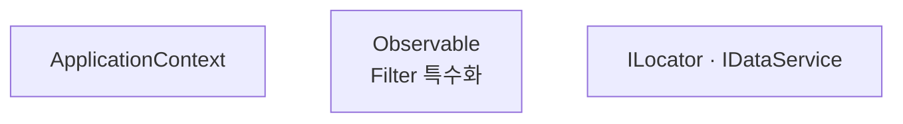

나쁜 예 (신택스 에러 발생):
```
A[ApplicationContext<br/>Composition Root]    %% 따옴표 없이 <br/> → 에러
B[ILocator · IDataService]                   %% 따옴표 없이 가운뎃점 → 에러
```

**`[""]`가 필요한 경우:**
- `<br/>`, `<i>`, `<b>` 등 HTML 태그
- `·`, `↔`, `()`, `<>`, `/`, `+`, `-` 등 특수문자
- 한글
- 공백이 포함된 여러 단어

단순 영문 한 단어만 → 따옴표 없이 `[]` 가능

## subgraph — 가장 빈번한 에러 원인

**형식: `subgraph 영문ID["표시 라벨"]`**

모든 subgraph에 예외 없이 적용한다. 중첩 subgraph도 동일.
**subgraph 안에 `direction` 키워드를 쓰지 않는다** (8.8.0 미지원).

좋은 예:
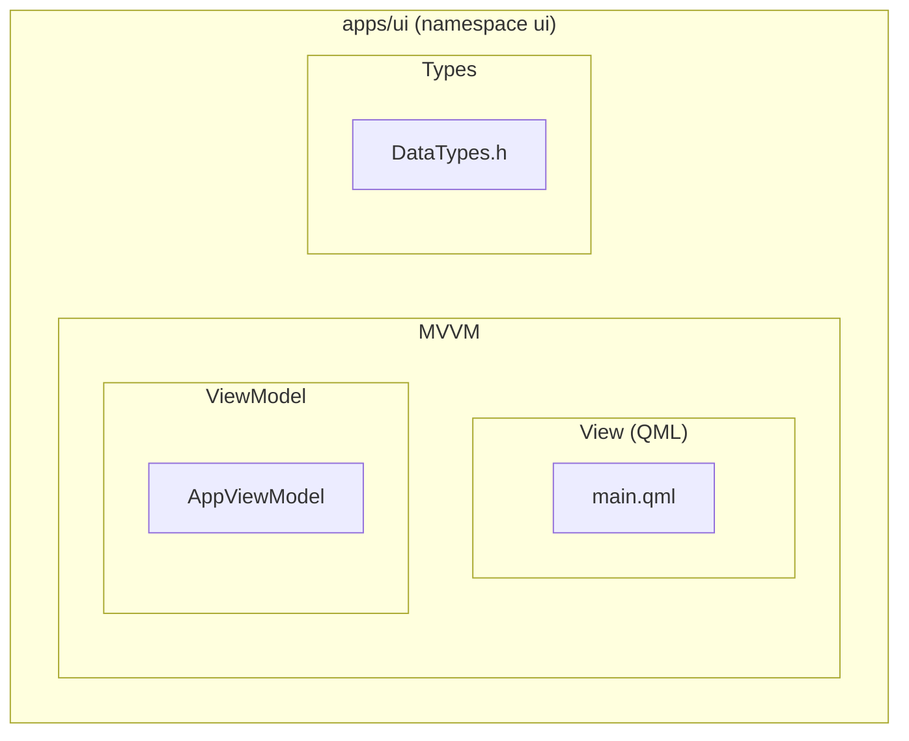

나쁜 예 (전부 신택스 에러):
```
flowchart TD                              %% flowchart → 에러, graph를 써야 함
    subgraph APP["apps/ui"]
        direction TB                      %% direction → 에러, 8.8.0 미지원
    end
subgraph "apps/ui (namespace ui)"         %% ID 없이 문자열만 → 에러
subgraph "MVVM"                           %% ID 없이 따옴표 문자열 → 에러
subgraph "View (QML)"                     %% ID 없이 따옴표 문자열 → 에러
```

**subgraph 체크리스트:**
- [ ] 다이어그램의 **모든** subgraph가 `subgraph ID["라벨"]` 형식인가?
- [ ] 중첩된 subgraph도 빠짐없이 ID가 있는가?
- [ ] subgraph ID가 영문+숫자만인가?
- [ ] subgraph 안에 `direction` 키워드가 없는가?

## 연결선 — `&` 연산자 절대 금지

좋은 예:
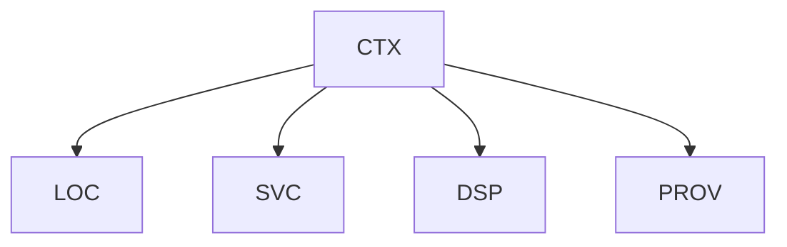

나쁜 예 (& 연산자 에러):
```
CTX --> LOC & SVC & DSP & PROV
```

**`&`를 쓰고 싶은 충동이 들면** 반드시 별도 라인으로 풀어 쓴다.

추가 연결선 문법:
- 점선: `-.->`, 라벨 점선: `-. 텍스트 .->` 또는 `-.->|텍스트|`
- 굵은선: `==>`, 라벨: `==>|텍스트|`

## 스타일

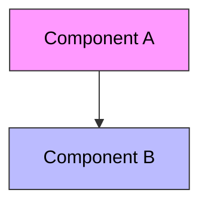

classDef로 재사용:
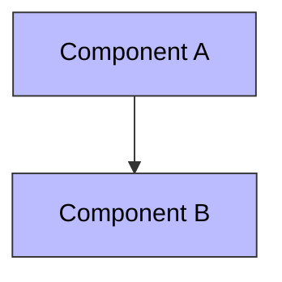

**규칙:**
- `style`은 다이어그램 맨 아래에 배치한다
- 여러 노드에 같은 스타일이면 `classDef` + `class`를 사용한다
- `fill` 지정 시 `color`도 함께 지정한다 (가독성)

## 가독성 — 다이어그램이 읽히려면

**한 다이어그램에 노드 15개를 넘기지 않는다.**
넘으면 노드가 축소되어 텍스트를 읽을 수 없다.

### 큰 시스템은 분할한다

하나의 거대한 다이어그램 대신 **레이어별/역할별로 나눠서** 여러 개의 작은 다이어그램을 만든다.

```markdown
### 전체 레이어 구조

(graph TD — 레이어 3~5개만, 각 레이어에 대표 컴포넌트 1~2개)

### View 레이어 상세

(graph LR — View 내부 컴포넌트만)

### ViewModel ↔ Service 연결

(graph LR — ViewModel과 Service 간 의존성만)
```

**나쁜 예:** 전체 프로젝트의 모든 클래스를 하나의 다이어그램에 넣는 것

### 분할 기준

| 상황 | 분할 방법 |
|------|-----------|
| 레이어가 3개 이상 | 오버뷰 1개 + 레이어별 상세 다이어그램 |
| subgraph가 3단계 중첩 | 상위 구조 1개 + 하위 상세 분리 |
| 노드가 15개 초과 | 역할별로 나누어 별도 다이어그램 |
| 연결선이 교차 | 관련 노드끼리 묶어 별도 다이어그램 |

### 라벨은 짧게

- 노드 라벨: 클래스명/파일명만 (경로나 설명 넣지 않음)
- 연결선 라벨: 동사 1개 (implements, creates, calls)
- subgraph 라벨: 레이어/모듈명만

좋은 예 (오버뷰 — 레이어만):
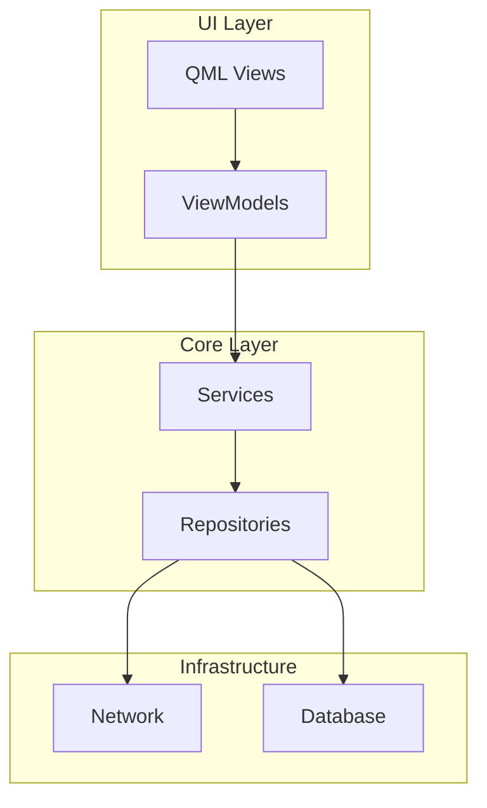

나쁜 예 (모든 클래스를 한 다이어그램에 — 15개 초과):
```
graph TD
    subgraph UI["UI Layer"]
        subgraph VIEWS["Views"]
            A["main.qml"]
            B["FullLayout"]
            C["PageA.qml"]
            D["PageB.qml"]
            E["PageC.qml"]
        end
        subgraph VMS["ViewModels"]
            F["AppViewModel"]
            G["PageAViewModel"]
            H["PageBViewModel"]
            I["PageCViewModel"]
        end
    end
    subgraph CORE["Core"]
        J["ServiceLocator"]
        K["LogService"]
        L["DataService"]
        M["CrashHandler"]
        N["ExternalDataService"]
    end
    %% ... 이미 15개 초과, 읽을 수 없음
```

## 다이어그램 유형 선택

| 용도 | 유형 | 예시 |
|------|------|------|
| 모듈/레이어 구조 | `graph TD` | 아키텍처 오버뷰 |
| 호출 관계 (좌→우) | `graph LR` | reference 의존성 |
| 시퀀스/시나리오 | `sequenceDiagram` | API 호출 흐름 |
| 클래스 관계 | `classDiagram` | 상속/구현 관계 |
| 상태 전이 | `stateDiagram-v2` | 라이프사이클 |

## sequenceDiagram 규칙

API 호출 흐름, 시나리오 묘사에 사용한다.

### 기본 문법

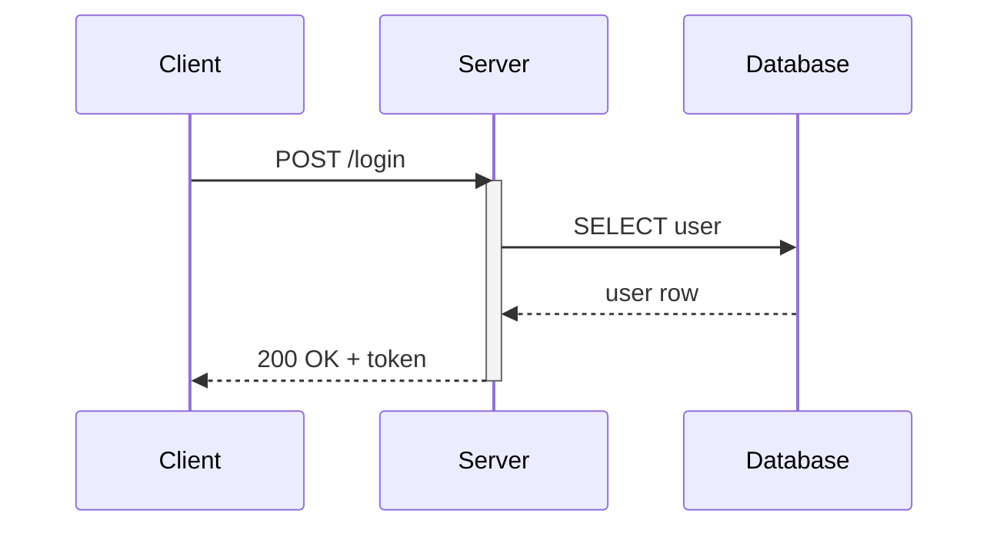

### 화살표 종류

| 문법 | 의미 |
|------|------|
| `->>` | 실선 화살표 (동기 요청) |
| `-->>` | 점선 화살표 (응답) |
| `-x` | 실선 + X (실패/취소) |
| `--x` | 점선 + X |

### 블록 문법

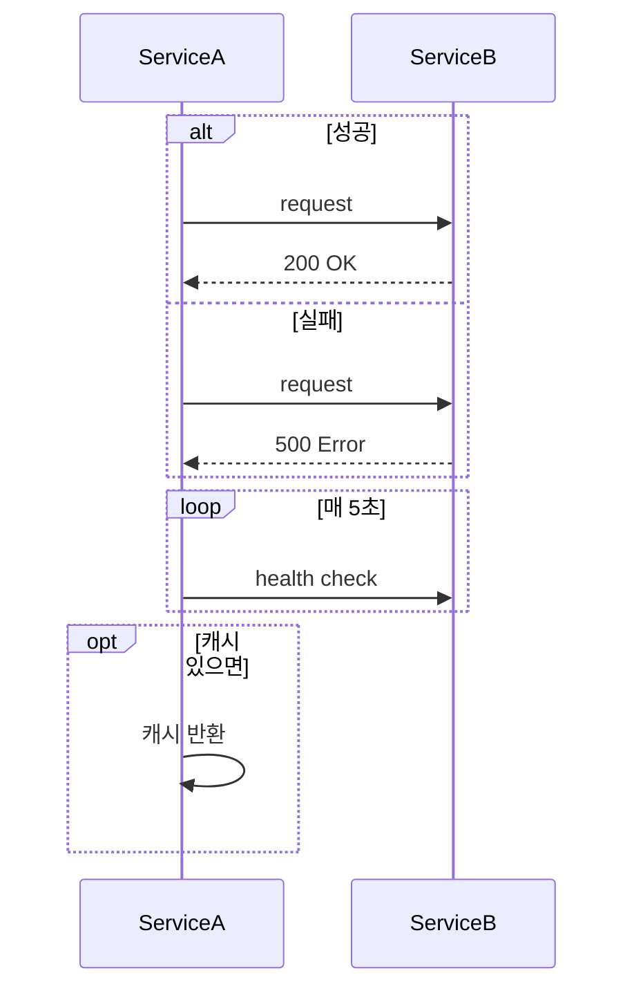

### 주의사항

- `participant` 선언 순서가 좌→우 배치 순서를 결정한다
- `as` 별칭을 사용하면 이후 별칭으로만 참조한다
- `Note over A,B: 텍스트` 로 노트를 추가한다
- `activate`/`deactivate` 또는 `+`/`-` 접미사로 활성화 표시: `A->>+B: req` / `B-->>-A: res`
- 메시지 라벨에 `:` 뒤 텍스트를 쓴다 (따옴표 불필요)

## classDiagram 규칙

클래스 관계, 상속/구현 구조 묘사에 사용한다.

### 기본 문법

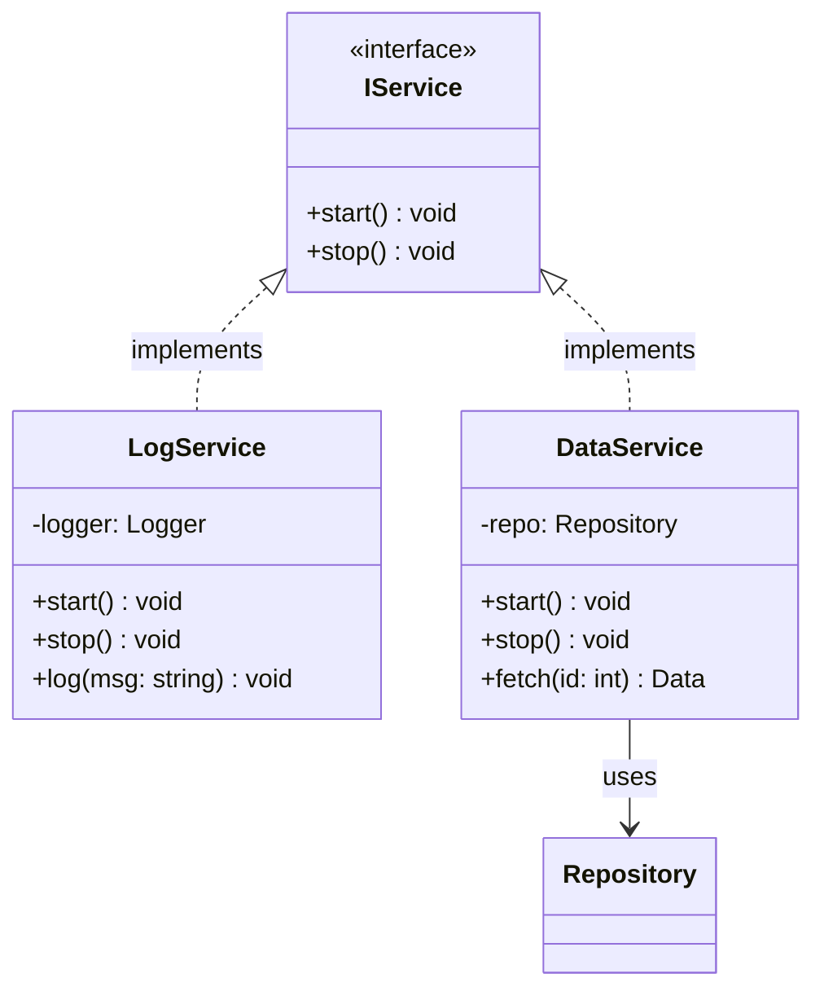

### 관계 표기

| 문법 | 의미 |
|------|------|
| `<\|--` | 상속 (extends) |
| `<\|..` | 구현 (implements) |
| `-->` | 의존 (uses) |
| `--*` | 합성 (composition) |
| `--o` | 집합 (aggregation) |
| `..>` | 점선 의존 |

### 접근제어자

| 기호 | 의미 |
|------|------|
| `+` | public |
| `-` | private |
| `#` | protected |
| `~` | package/internal |

### 주의사항

- `<<interface>>`, `<<abstract>>`, `<<enumeration>>` 으로 스테레오타입 표기
- 메서드: `+methodName(param: Type) ReturnType` 형식
- 속성: `+fieldName: Type` 형식
- 관계 라벨은 `: 라벨` 로 끝에 추가
- 한 다이어그램에 클래스 10개 이하 권장 — 넘으면 패키지별로 분할

## stateDiagram-v2 규칙

상태 전이, 라이프사이클 묘사에 사용한다. 반드시 `stateDiagram-v2`를 쓴다 (`stateDiagram`은 구버전).

### 기본 문법

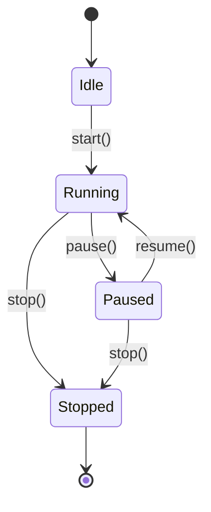

### 중첩 상태

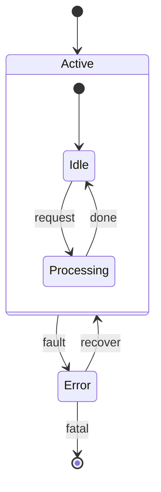

### 주의사항

- `[*]`은 시작/종료 상태 (위치에 따라 자동 구분)
- 전이 라벨: `StateA --> StateB : 이벤트/조건`
- 상태 ID는 영문만 사용 (한글 금지)
- `state "표시 라벨" as S1` 으로 한글 라벨을 별칭 지정
- 중첩은 `state ParentState { ... }` 블록으로
- 중첩 2단계까지 권장 — 넘으면 분할
- `note right of StateA: 설명` 으로 노트 추가

## subgraph 간 연결 주의

subgraph ID끼리 직접 연결(`YAML --> FILES`)은 렌더러에 따라 깨질 수 있다.
**subgraph 내부의 노드끼리 연결**하는 것이 안전하다.

나쁜 예 (subgraph ID 간 직접 연결 — 렌더러 호환성 문제):
```
graph TD
    subgraph A["Group A"]
        A1["Node 1"]
    end
    subgraph B["Group B"]
        B1["Node 2"]
    end
    A --> B
```

좋은 예 (내부 노드 간 연결):
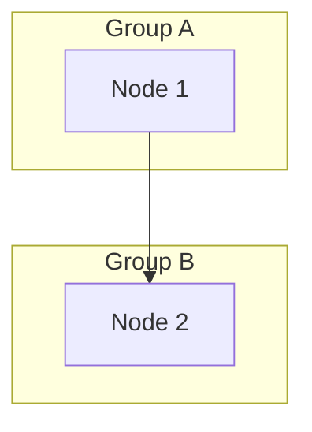

## stateDiagram-v2 상태 ID 규칙

- 상태 ID에 **underscore(`_`) 사용 금지** — 일부 렌더러에서 파싱 오류
- PascalCase 또는 camelCase 사용: `InProgress`, `inProgress` (O)
- snake_case 사용 금지: `in_progress` (X)
- 한글 라벨이 필요하면: `state "진행 중" as InProgress`

나쁜 예:
```
stateDiagram-v2
    [*] --> in_progress
    in_progress --> build_failed
```

좋은 예:
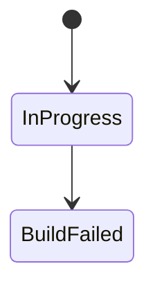

## 생성 후 검증 체크리스트

생성한 Mermaid 코드를 아래 체크리스트로 **반드시** 검증한다:

1. `flowchart` 키워드가 없는가? → `graph`로 교체
2. `direction` 키워드가 없는가? → 삭제
3. **모든** `subgraph`에 영문 ID가 붙어있는가? → `subgraph ID["라벨"]`
4. `&` 연산자가 없는가? → 별도 라인으로 분리
5. 노드 ID에 한글/특수문자가 없는가?
6. 특수문자/한글 라벨이 전부 `[""]`로 감싸져 있는가?
7. 노드 ID가 subgraph 포함 전체에서 중복되지 않는가?
8. 빈 subgraph가 없는가? (최소 1개 노드 필요)
9. **노드가 15개를 넘지 않는가?** → 넘으면 분할
10. subgraph 중첩이 3단계를 넘지 않는가? → 넘으면 분할
11. subgraph ID끼리 직접 연결하지 않고 **내부 노드끼리** 연결하는가?
12. `stateDiagram-v2`에서 상태 ID에 underscore(`_`)가 없는가? → PascalCase 사용
